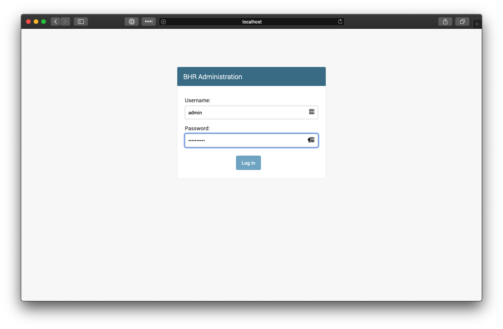
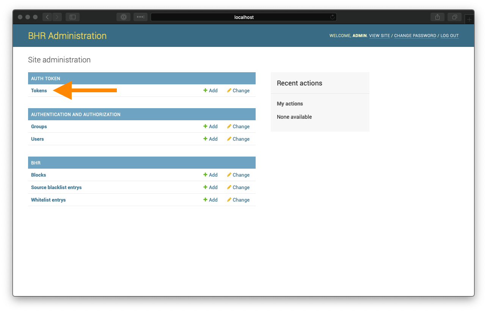
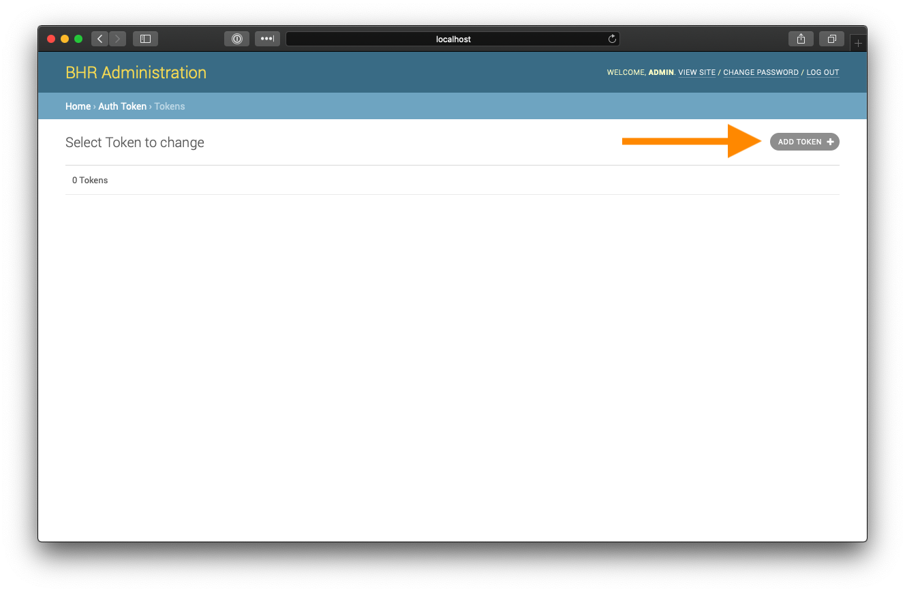
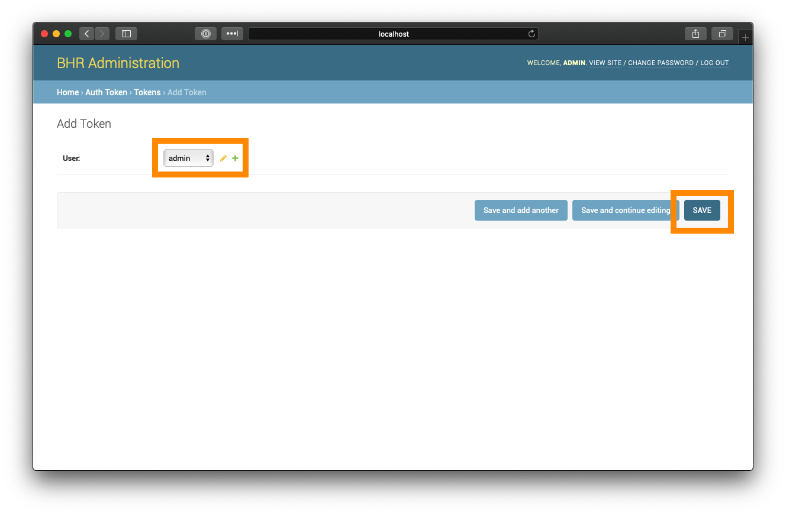
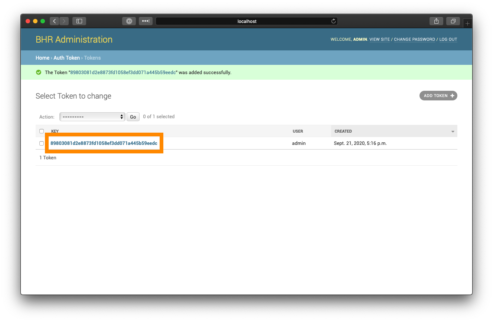

#Installing BHR

## Setting up your BHR environment

First, create a directory to hold the BHR repositories:

    $ mkdir -p /opt/bhr
    $ cd /opt/bhr
    
Clone the bhr-site and bhr-client-exabgp repositories to your directory:

    $ git clone https://github.com/ncsa/bhr-site.git
    $ git clone https://github.com/ncsa/bhr-client-exabgp.git
    
Next, create the directories `templates` and `postgres-data`. 
    
    $ mkdir templates
    $ mkdir postgres-data
    
* `templates` will be used to hold your ExaBGP template file
* `postgres-data` will be used as a persistent volume for your PostgreSQL database.

Copy the following file to `docker-compose.yml`, using your preferred text editor.

    version: '3'
    services:
        db:
          image: postgres
          env_file:
            - bhr.env
          volumes:
            - ./postgres-data:/var/lib/postgresql/data
        bhr-site:
          build:
            context: ./bhr-site
            dockerfile: Dockerfile
          command: python manage.py runserver 0.0.0.0:8000
          volumes:
            - ./bhr-site:/app
          ports:
            - "8000:8000"
          depends_on:
            - db
          env_file:
            - bhr.env
        bhr-exabgp:
          build:
            context: ./bhr-client-exabgp
            dockerfile: Dockerfile
          env_file:
            - bhr.env
          volumes:
            - ./templates:/code/templates
            
Copy the following environment variable to `bhr.env`. We will be modifying this file throughout the build process.

    # PostgreSQL environment variables
    POSTGRES_DB=bhr
    POSTGRES_PASSWORD=set_your_db_password_here
    
    # bhr-site environment variables
    DATABASE_URL=postgres://postgres:set_your_db_password_here_too@db/bhr
    
    # bhr-client-exabgp variables
    BHR_HOST=http://bhr-site:8000
    BHR_TOKEN=your_api_token
    BHR_IDENT=bhr
    BHR_TEMPLATE=/code/templates/template.mako
    
Change the `POSTGRES_PASSWORD` and `DATABASE_URL` variables to a secure password. This will be the password that is used by PostgreSQL.

## Starting PostgreSQL

We'll begin by starting the PostgreSQL database using docker-compose. Run the following command to start PostgreSQL:

    $ docker-compose up -d db
    
After running `docker-compose ps`, you should see the following output:

    $ docker-compose ps
      Name                Command              State    Ports  
    -----------------------------------------------------------
    bhr_db_1   docker-entrypoint.sh postgres   Up      5432/tcp
    
## Starting bhr-site

Before we start bhr-site, we need to modify the Django settings file to contain our domains.

Open the file `bhr-site/bhr_site/settings.py` and locate the `ALLOWED_HOSTS` variable.

You will need to add the string "bhr-site", as well as any domain name that you will be accessing BHR from.

    ALLOWED_HOSTS = ['bhr-site', 'your.domain.here.com']
    
Next, build bhr-site using the following command:

    $ docker-compose build bhr-site
    
Once the build process finishes, run the following docker-compose commands to configure bhr-site:

    $ docker-compose run --rm web python manage.py migrate
    $ docker-compose run --rm web python manage.py createsuperuser
    $ docker-compose run --rm web python manage.py creategroups
    
After running the `createsuperuser` command, you will be prompted to configure the default BHR admin account.

Once this is complete, start bhr-site using the following command:

    $ docker-compose up -d bhr-site
    
After running `docker-compose ps`, you should see the following output:

    $ docker-compose ps
         Name                   Command               State           Ports         
    --------------------------------------------------------------------------------
    bhr_bhr-site_1   python manage.py runserver ...   Up      0.0.0.0:8000->8000/tcp
    bhr_db_1         docker-entrypoint.sh postgres    Up      5432/tcp            

## Configuring bhr-site

Verify that you can access BHR by browsing to http://your.domain.here.com:8000. 
You should see the following page if everything is running as expected.

Navigate to http://your.domain.here.com:8000/admin, and login with the credentials you set in [Starting bhr-site](bhr_install.md#starting-bhr-site).

After logging in, click "Tokens".

Click "ADD TOKEN"

Select your username from the dropdown list, and click "Save"

The token that is created will be the BHR API token for this user. Save this value for use later.

## Configuring bhr-client-exabgp

!!! caution 
    We recommend working with your Network Engineers to determine the proper values for these settings prior to running BHR in production.

Copy the following file to `templates/template.mako`.

    <%def name="block_v4(action, cidrs)" filter="trim">
    ${action} attribute next-hop ${ipv4} community [ 65142:666 no-export ] nlri ${" ".join(cidrs)}
    </%def>
    <%def name="block_v6(action, cidrs)" filter="trim">
        ${action} attribute next-hop ${ipv6} community [ 65142:666 no-export ] nlri ${" ".join(cidrs)}
    </%def>
    <%def name="block(action, cidrs)" filter="trim">
    ## cidrs are grouped by v4 or v6. If one address is v4, they all are.
    %if ':' in cidrs[0]:
        ${block_v6(action, cidrs)}
    %else:
        ${block_v4(action, cidrs)}
    %endif
    </%def>
    
    group edgerouters {
        peer-as 65000;
        local-as 64512;
        hold-time 3600;
        router-id ${ip};
        local-address ${ip};
        graceful-restart 1200;
        group-updates;
    
        md5 'hello';
        static {
        }
        process bhr-dynamic {
            # auto filled in by bhr-client-exabgp-write-template
            run ${path_to_bhr_client_exabgp_loop};
        }
    
        neighbor 192.168.2.201 {
            description "edge-1";
        }
    
    }

You will most likely want to modify the following values:
    
* peer-as
* local-as
* router-id
* local-address
* neighbor

As well as setting the proper AS values in the following lines:

    ${action} attribute next-hop ${ipv4} community [ 65142:666 no-export ] nlri ${" ".join(cidrs)}
    
    ${action} attribute next-hop ${ipv6} community [ 65142:666 no-export ] nlri ${" ".join(cidrs)}

For testing purposes, you can leave these values as is.

Next, we will want to modify the `bhr.env` file with the API token created in [Configuring bhr-site](bhr_install.md#configuring-bhr-site).

Modify the `BHR_TOKEN` environment variable to contain this API token.

    # bhr-client-exabgp variables
    BHR_HOST=http://bhr-site:8000
    BHR_TOKEN=your_api_token
    BHR_IDENT=bhr
    BHR_TEMPLATE=/code/templates/template.mako
    
## Starting bhr-client-exabgp

Now, we want to start the bhr-client-exabgp container to start handling new BHR entries. Run the following command to start bhr-client-exabgp.

    $ docker-compose up -d bhr-exabgp
    
After running `docker-compose ps`, you should see the following output:

    $ docker-compose ps
          Name                    Command               State           Ports         
    ----------------------------------------------------------------------------------
    bhr_bhr-exabgp_1   /bin/sh -c /code/examples/ ...   Up                            
    bhr_bhr-site_1     python manage.py runserver ...   Up      0.0.0.0:8000->8000/tcp
    bhr_db_1           docker-entrypoint.sh postgres    Up      5432/tcp              
    
If everything is successful, you should see the following in the output of `docker-compose logs bhr-exabgp` 

    bhr-exabgp_1  | Mon, 21 Sep 2020 17:40:10 | INFO     | 7      | reactor       | New peer setup: neighbor 192.168.2.201 local-ip 172.21.0.4 local-as 64512 peer-as 65000 router-id 172.21.0.4 family-allowed in-open
    bhr-exabgp_1  | Mon, 21 Sep 2020 17:40:10 | INFO     | 7      | configuration | Loaded new configuration successfully
    bhr-exabgp_1  | Mon, 21 Sep 2020 17:40:10 | INFO     | 7      | processes     | Forked process bhr-dynamic

