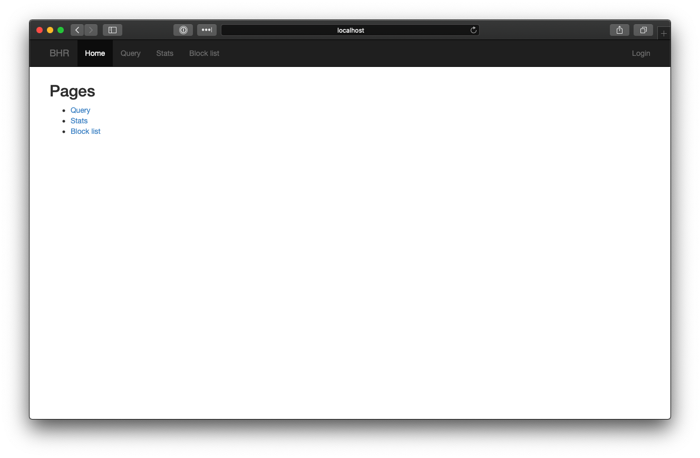

#Installing BHR

## Setting up your BHR environment

First, create a directory to hold the BHR repositories:

    $ mkdir -p /opt/bhr
    $ cd /opt/bhr
    
Clone the bhr-site and bhr-client-exabgp repositories to your directory:

    $ git clone https://github.com/ncsa/bhr-site.git
    $ git clone https://github.com/ncsa/bhr-client-exabgp.git
    
Next, create the directories `templates` and `postgres-data`. 
    
    $ mkdir templates
    $ mkdir postgres-data
    
* `templates` will be used to hold your ExaBGP template file
* `postgres-data` will be used as a persistent volume for your PostgreSQL database.

Copy the following file to `docker-compose.yml`, using your preferred text editor.

    version: '3'
    services:
        db:
          image: postgres
          env_file:
            - bhr.env
          volumes:
            - ./postgres-data:/var/lib/postgresql/data
        web:
          image: nginx
          ports:
            - 80:80
            - 443:443
          volumes:
            - ./nginx/certs:/etc/nginx/certs:z
            - ./nginx/nginx.conf:/etc/nginx/nginx.conf:ro
            - ./bhr-site/staticfiles:/static/static
        bhr-site:
          build:
            context: ./bhr-site
            dockerfile: Dockerfile
          command: gunicorn bhr_site.wsgi --bind=0.0.0.0:8000 --workers=8 --timeout=45 --max-requests=500 --log-file -
          volumes:
            - ./bhr-site:/app
            - ./settings_local.py:/app/bhr_site/settings_local.py       
          ports:
            - "8000:8000"
          depends_on:
            - db
          environment:
            - PYTHONPATH=/app/bhr_site
          env_file:
            - bhr.env
        bhr-exabgp:
          build:
            context: ./bhr-client-exabgp
            dockerfile: Dockerfile
          env_file:
            - bhr.env
          volumes:
            - ./templates:/code/templates
            
Copy the following environment variable to `bhr.env`. We will be modifying this file throughout the build process.

    # PostgreSQL environment variables
    POSTGRES_DB=bhr
    POSTGRES_PASSWORD=set_your_db_password_here
    
    # bhr-site environment variables
    DATABASE_URL=postgres://postgres:set_your_db_password_here_too@db/bhr
    
    # bhr-client-exabgp variables
    BHR_HOST=http://bhr-site:8000
    BHR_TOKEN=your_api_token
    BHR_IDENT=bhr
    BHR_TEMPLATE=/code/templates/template.mako
    
!!!note
    Do not modify the `BHR_HOST` variable. This name is used internally by Docker, and changing this can cause BHR to break.
    
Change the `POSTGRES_PASSWORD` and `DATABASE_URL` variables to a secure password. This will be the password that is used by PostgreSQL.

## Starting PostgreSQL

We'll begin by starting the PostgreSQL database using docker-compose. Run the following command to start PostgreSQL:

    $ docker-compose up -d db
    
After running `docker-compose ps`, you should see the following output:

    $ docker-compose ps
      Name                Command              State    Ports  
    -----------------------------------------------------------
    bhr_db_1   docker-entrypoint.sh postgres   Up      5432/tcp
    
## Configuring nginx

In order to enable TLS for bhr-site, we will need to configure an Nginx container to proxy connections to bhr-site.

Begin by creating directories for storing your SSL certificates and Nginx config.

    $ mkdir -p nginx/certs
    
Copy your certificate (.crt) and key (.key) files to `nginx/certs/`.

If you wish to create a self-signed certificate for your build, run the following command. 
Replace "your.domain.here.com" with the hostname of your server.

    $ openssl req -subj /CN=your.domain.here.com -x509 -newkey rsa:4096 -nodes -keyout nginx/certs/bhr.key -out nginx/certs/bhr.crt -days 365
    
Next, copy the following file to `nginx/nginx.conf`:

    pid /run/nginx.pid;
    include /etc/nginx/modules-enabled/*.conf;
    events {
            worker_connections 768;
            # multi_accept on;
    }
    http {
            sendfile on;
            tcp_nopush on;
            tcp_nodelay on;
            keepalive_timeout 65;
            types_hash_max_size 2048;
            include /etc/nginx/mime.types;
            default_type application/octet-stream;
            ssl_protocols TLSv1.2; # Dropping SSLv3, ref: POODLE
            ssl_prefer_server_ciphers on;
            access_log /var/log/nginx/access.log;
            error_log /var/log/nginx/error.log;
            gzip on;
            
            server {
                listen 80;
                server_name localhost;
                return 301 https://$host$request_uri;
            }

           server {
                listen 443 ssl;
                server_name localhost;
                ssl_certificate /etc/nginx/certs/bhr.crt;
                ssl_certificate_key /etc/nginx/certs/bhr.key;
                location / {
                    proxy_pass http://bhr-site:8000/;
                    error_log /var/log/front_end_errors.log;
                }
                location /static/ {
                    root /static;
                }
           }
    }

!!!note
    Do not modify the `proxy_pass` variable. This name is used internally by Docker, and changing this can cause BHR to break.
    
Make sure to modify the server_name to the name of your server in this file. 
Also, if you imported your own keys, make sure to change the .crt and .key file names to match your certificate and key files.
    
## Starting bhr-site

Before we start bhr-site, we need to create a local Django settings file to contain our domains.

Run the following command and copy the output.

    openssl rand -base64 48

Copy the following file to `settings_local.py` 
and set the `SECRET_KEY` variable value to the output from the `openssl` command above

    LOCAL_SETTINGS = True  # do not touch
    from settings import * # do not touch
    
    DEBUG = False
    ALLOWED_HOSTS = ['localhost', 'bhr-site']
    CSRF_COOKIE_SECURE = True
    SESSION_COOKIE_SECURE = True
    
    # openssl rand -base64 48
    SECRET_KEY = ''
    
    STATIC_ROOT="/app/staticfiles"
    
    BHR = {
        'time_multiplier':              2.0,
        'time_window_factor':           2.0,
        'minimum_time_window':          43200.0,
        'penalty_time_multiplier':      2.0,
        'return_to_base_multiplier':    2.0,
        'return_to_base_factor':        2.0,
        'unauthenticated_limited_query':  True,
        'local_networks':               ['10.0.0.0/8'],
        'minimum_prefixlen':            23,
        'minimum_prefixlen_v6':         64,
    }

    
Next, build bhr-site using the following command:

    $ docker-compose build bhr-site
    
Once the build process finishes, run the following docker-compose commands to configure bhr-site:

    $ docker-compose run --rm bhr-site python manage.py migrate
    $ docker-compose run --rm bhr-site python manage.py createsuperuser
    $ docker-compose run --rm bhr-site python manage.py creategroups
    $ docker-compose run --rm bhr-site python manage.py collectstatic
    
After running the `createsuperuser` command, you will be prompted to configure the default BHR admin account.

Once this is complete, start bhr-site using the following command:

    $ docker-compose up -d web bhr-site
    
After running `docker-compose ps`, you should see the following output:

    $ docker-compose ps
         Name                   Command               State                    Ports                  
    --------------------------------------------------------------------------------------------------
    bhr_bhr-site_1   python manage.py runserver ...   Up      0.0.0.0:8000->8000/tcp                  
    bhr_db_1         docker-entrypoint.sh postgres    Up      5432/tcp                                
    bhr_web_1        /docker-entrypoint.sh ngin ...   Up      0.0.0.0:443->443/tcp, 0.0.0.0:80->80/tcp           

## Configuring bhr-site

Verify that you can access BHR by browsing to https://your.domain.here.com

You should see the following page if everything is running as expected.

Navigate to https://your.domain.here.com/admin, and login with the credentials you set in [Starting bhr-site](bhr_install.md#starting-bhr-site).

After logging in, click "Tokens".

Click "ADD TOKEN"

Select your username from the dropdown list, and click "Save"

The token that is created will be the BHR API token for this user. Save this value for use later.

## Configuring bhr-client-exabgp

!!! caution 
    We recommend working with your Network Engineers to determine the proper values for these settings prior to running BHR in production.

Copy the following file to `templates/template.mako`.

    <%def name="block_v4(action, cidrs)" filter="trim">
    ${action} attribute next-hop ${ipv4} community [ 65142:666 no-export ] nlri ${" ".join(cidrs)}
    </%def>
    <%def name="block_v6(action, cidrs)" filter="trim">
        ${action} attribute next-hop ${ipv6} community [ 65142:666 no-export ] nlri ${" ".join(cidrs)}
    </%def>
    <%def name="block(action, cidrs)" filter="trim">
    ## cidrs are grouped by v4 or v6. If one address is v4, they all are.
    %if ':' in cidrs[0]:
        ${block_v6(action, cidrs)}
    %else:
        ${block_v4(action, cidrs)}
    %endif
    </%def>
    
    group edgerouters {
        peer-as 65000;
        local-as 64512;
        hold-time 3600;
        router-id ${ip};
        local-address ${ip};
        graceful-restart 1200;
        group-updates;
    
        md5 'hello';
        static {
        }
        process bhr-dynamic {
            # auto filled in by bhr-client-exabgp-write-template
            run ${path_to_bhr_client_exabgp_loop};
        }
    
        neighbor 192.168.2.201 {
            description "edge-1";
        }
    
    }

You will most likely want to modify the following values:
    
* peer-as
* local-as
* router-id
* local-address
* neighbor

As well as setting the proper AS values in the following lines:

    ${action} attribute next-hop ${ipv4} community [ 65142:666 no-export ] nlri ${" ".join(cidrs)}
    
    ${action} attribute next-hop ${ipv6} community [ 65142:666 no-export ] nlri ${" ".join(cidrs)}

For testing purposes, you can leave these values as is.

Next, we will want to modify the `bhr.env` file with the API token created in [Configuring bhr-site](bhr_install.md#configuring-bhr-site).

!!!note
    Do not modify the `BHR_HOST` variable. This name is used internally by Docker, and changing this can cause BHR to break.
    
Modify the `BHR_TOKEN` environment variable to contain this API token.

    # bhr-client-exabgp variables
    BHR_HOST=http://bhr-site:8000
    BHR_TOKEN=your_api_token
    BHR_IDENT=bhr
    BHR_TEMPLATE=/code/templates/template.mako
    
Once these files have been written, build the bhr-exabgp image.

    $ docker-compose build bhr-exabgp
    
## Starting bhr-client-exabgp

Now, we want to start the bhr-client-exabgp container to start handling new BHR entries. Run the following command to start bhr-client-exabgp.

    $ docker-compose up -d bhr-exabgp
    
After running `docker-compose ps`, you should see the following output:

    $ docker-compose ps
          Name                    Command               State           Ports         
    ----------------------------------------------------------------------------------
    bhr_bhr-exabgp_1   /bin/sh -c /code/examples/ ...   Up                            
    bhr_bhr-site_1     python manage.py runserver ...   Up      0.0.0.0:8000->8000/tcp
    bhr_db_1           docker-entrypoint.sh postgres    Up      5432/tcp              
    
If everything is successful, you should see the following in the output of `docker-compose logs bhr-exabgp` 

    bhr-exabgp_1  | Mon, 21 Sep 2020 17:40:10 | INFO     | 7      | reactor       | New peer setup: neighbor 192.168.2.201 local-ip 172.21.0.4 local-as 64512 peer-as 65000 router-id 172.21.0.4 family-allowed in-open
    bhr-exabgp_1  | Mon, 21 Sep 2020 17:40:10 | INFO     | 7      | configuration | Loaded new configuration successfully
    bhr-exabgp_1  | Mon, 21 Sep 2020 17:40:10 | INFO     | 7      | processes     | Forked process bhr-dynamic

