# Using BHR

## Blocking in BHR

1. Navigate to your BHR instance and click "Add Block" in the top menu bar
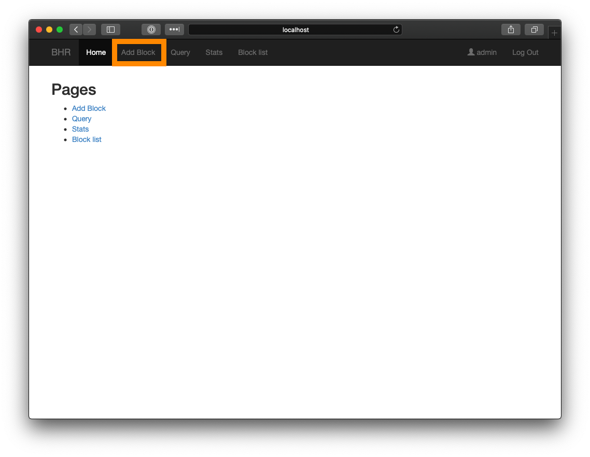
1. Input CIDR or IP address of host or subnet you wish to block, along with a description, and duration for the block, and click "Block."
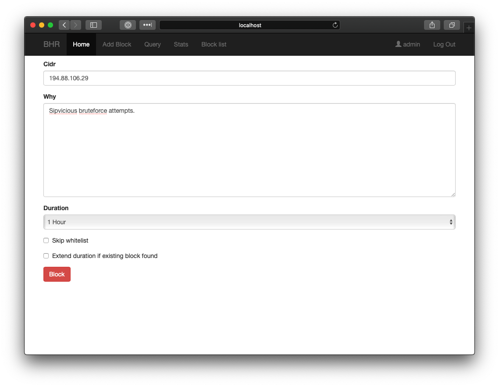
1. Verify that the host has been blocked.
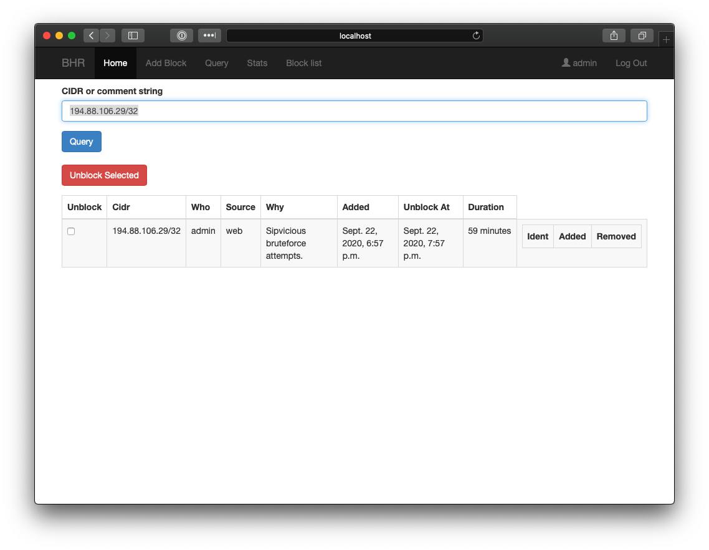

## Whitelisting in BHR

1. Navigate to https://your.bhr.instance.com/admin, and click "Whitelist entrys" under the "BHR" section
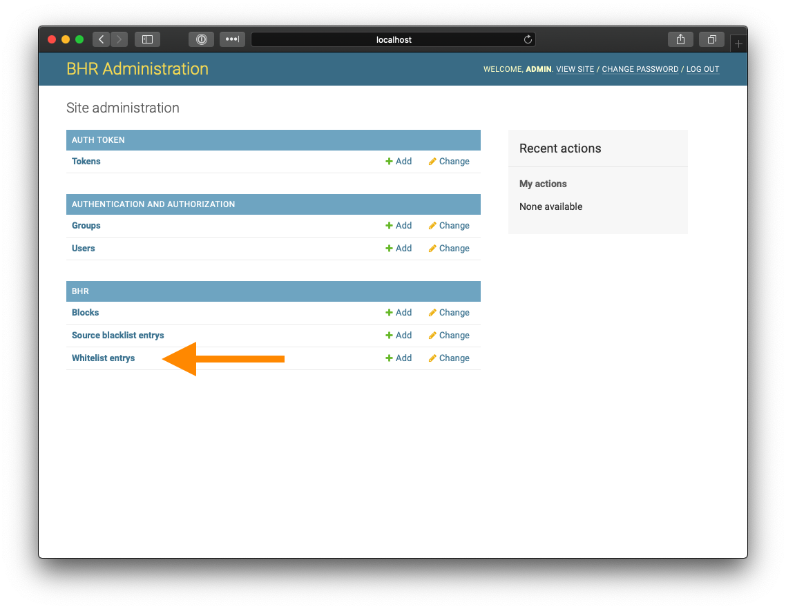
1. Click the "ADD WHITELIST ENTRY" button at the top right of the application
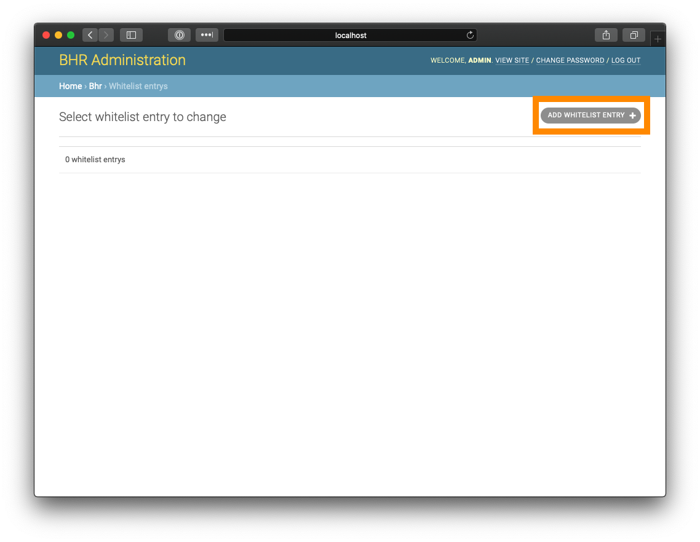
1. Insert IP address or subnet, select your username, add a description, and click "SAVE."
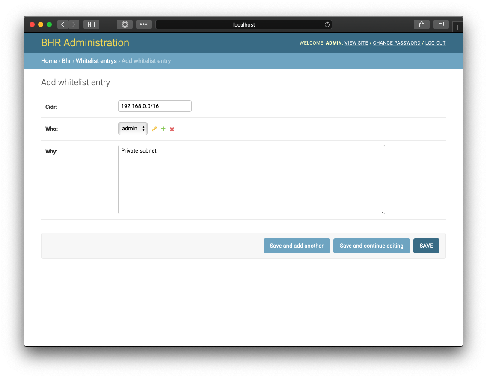
1. Verify that whitelist entry saved successfully.
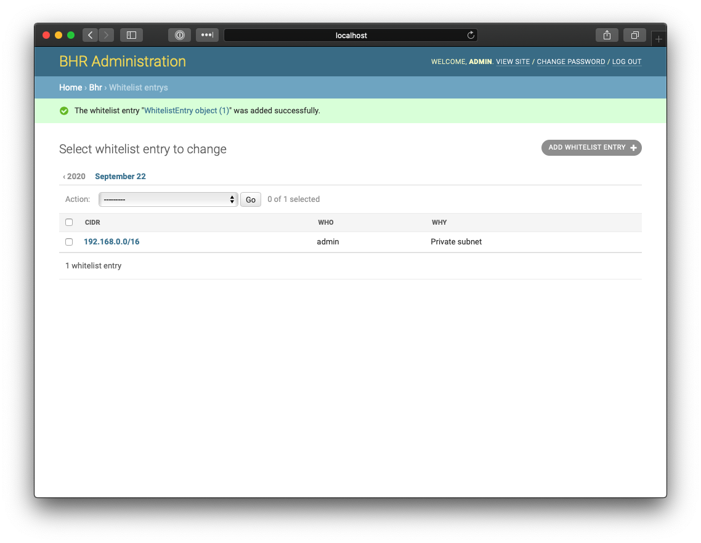

## Querying Blocks in BHR

1. Navigate to your BHR instance, and click "Query" in the top menu bar.
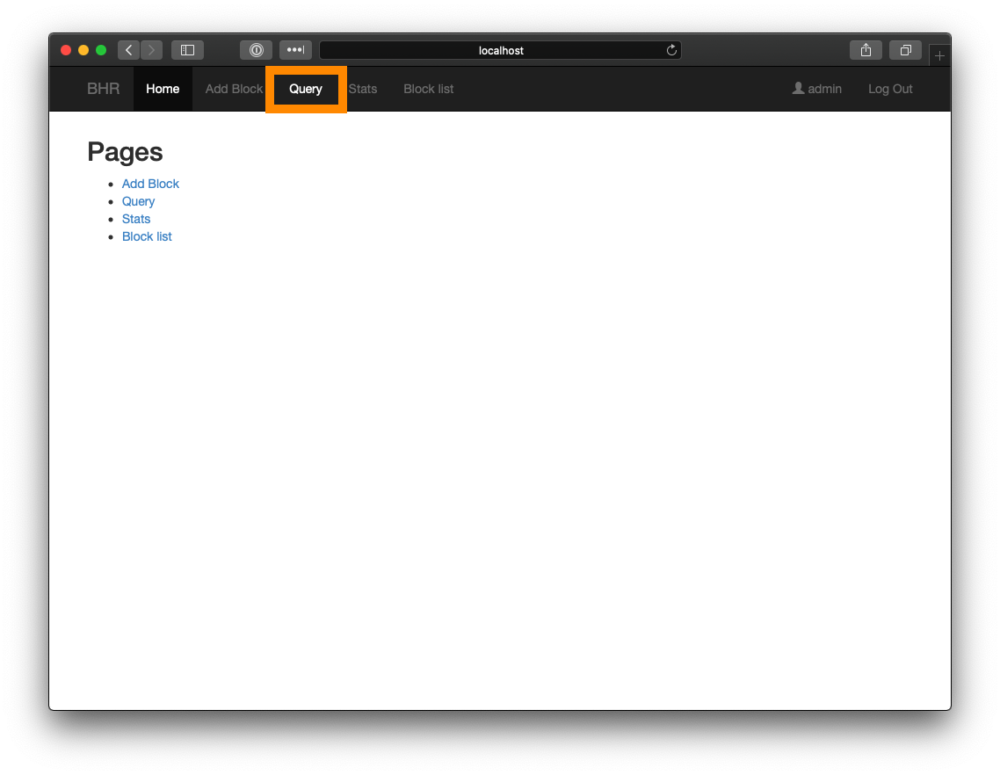
1. Type IP address or subnet in text box and click "Query"
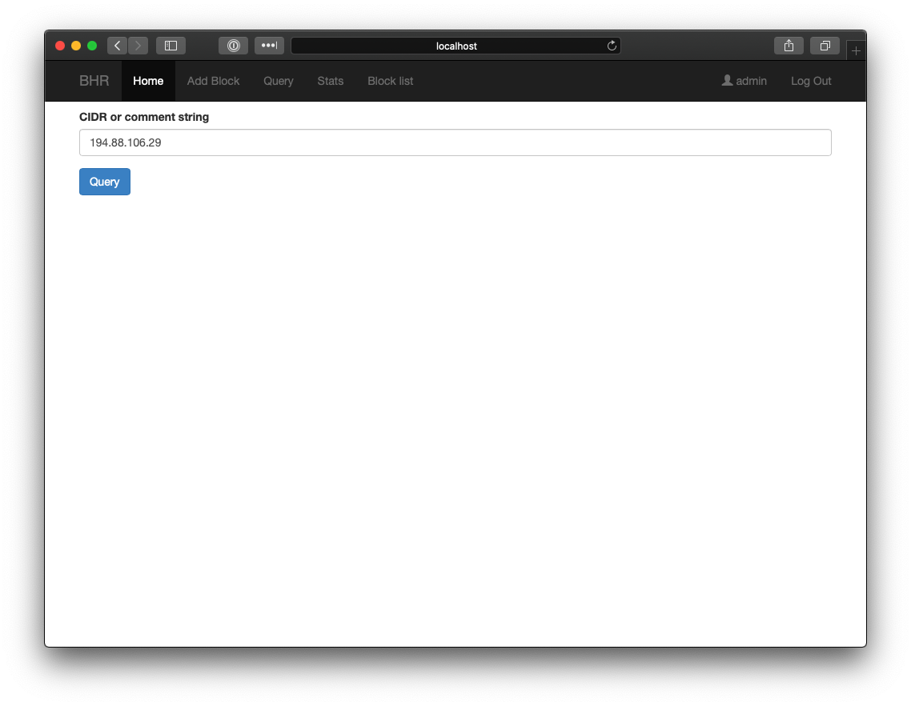
1. Results should be returned if there is currently a block in place, along with the time the host was blocked, and the time it will be removed from BHR

## Adding Users to BHR

1. Navigate to https://your.bhr.instance.com/admin, and click the "Add" link next to "Users" under "Authentication and Authorization"
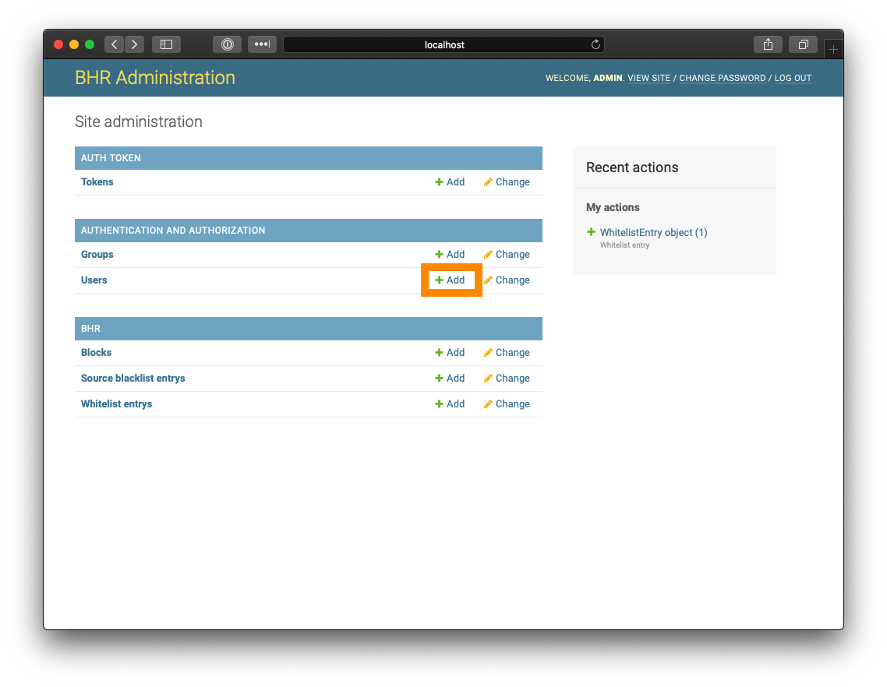
1. Set username and password, and click "Save and Continue Editing"
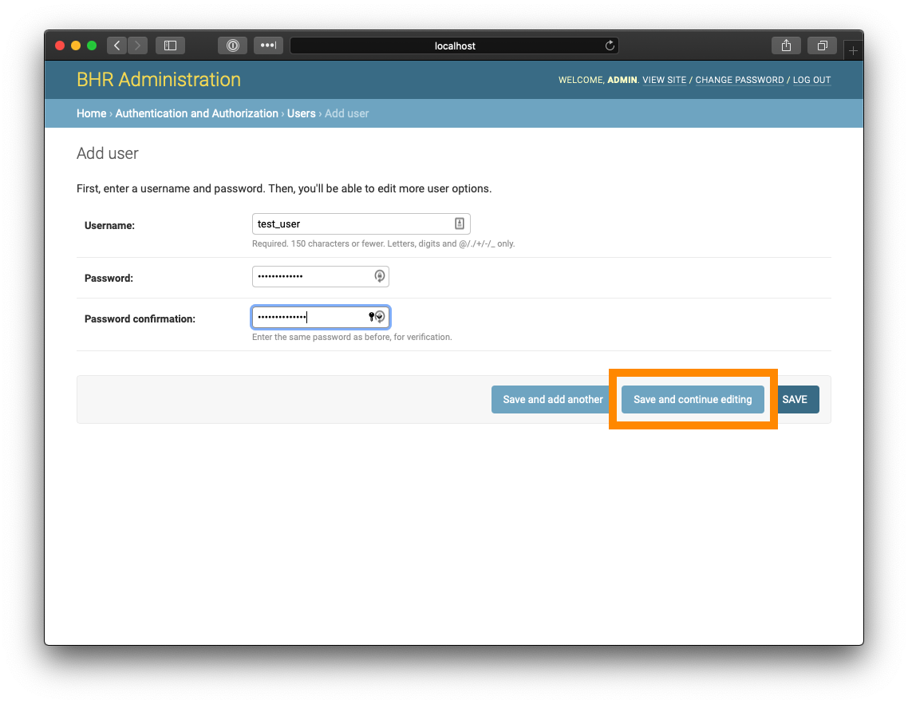
1. Scroll down, and set Permissions. You can set these manually via the Available groups, or via the Staff status checkbox if you wish for the user to have admin access.
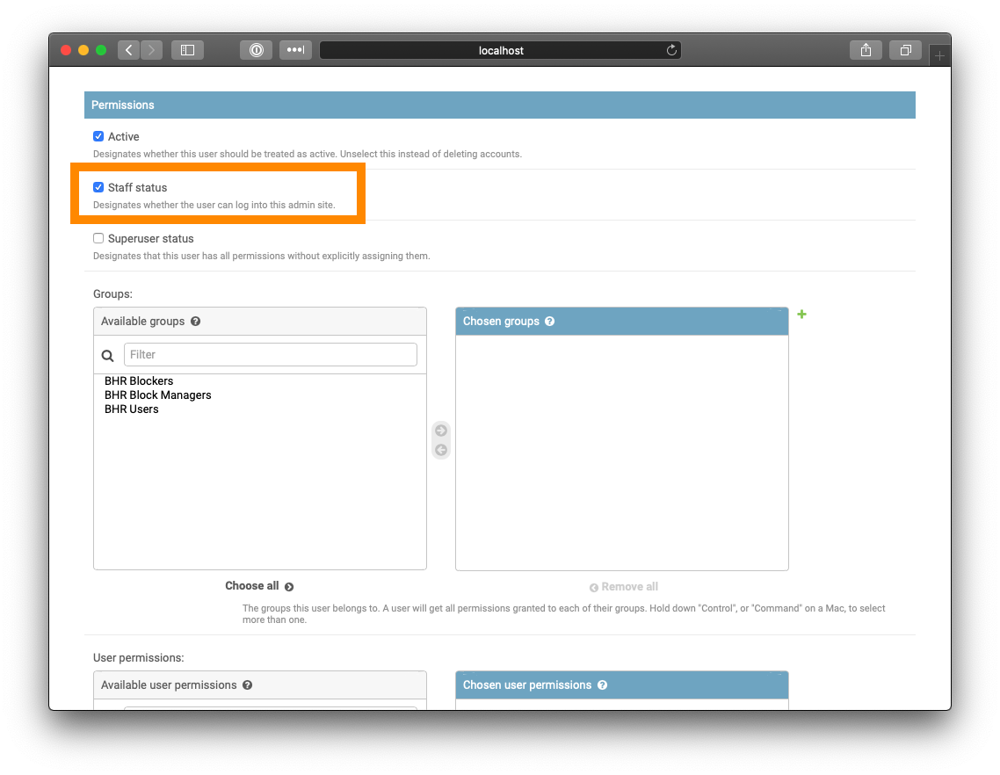
1. Click "Save" to save the account
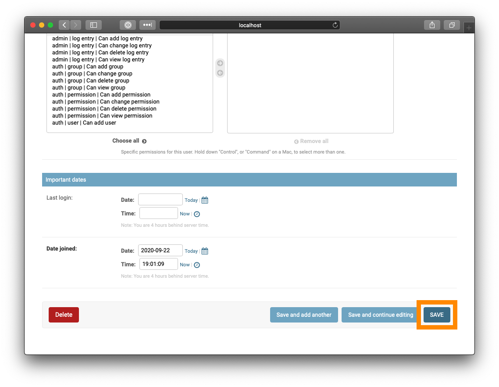